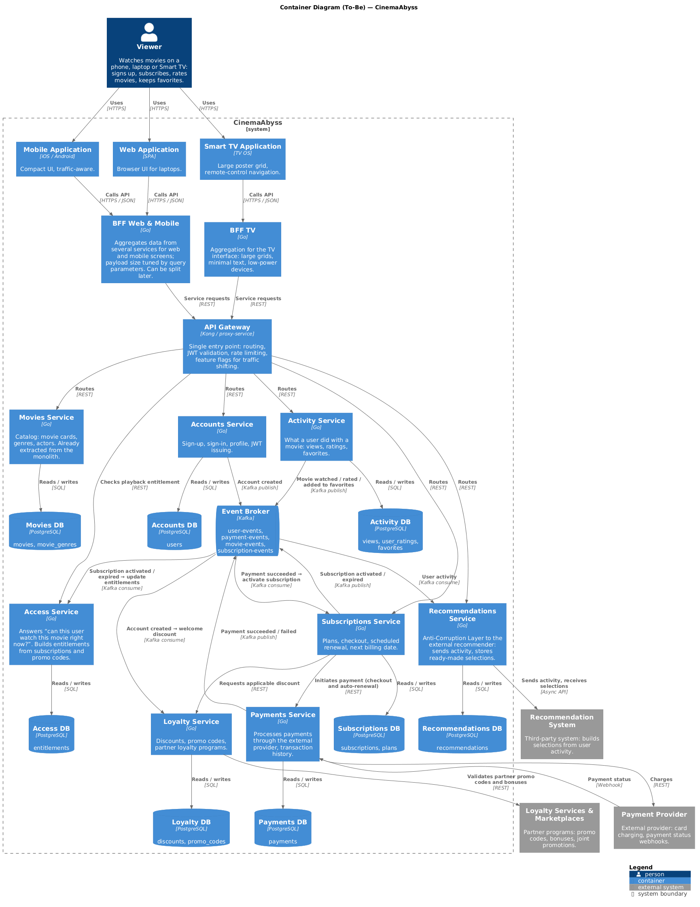
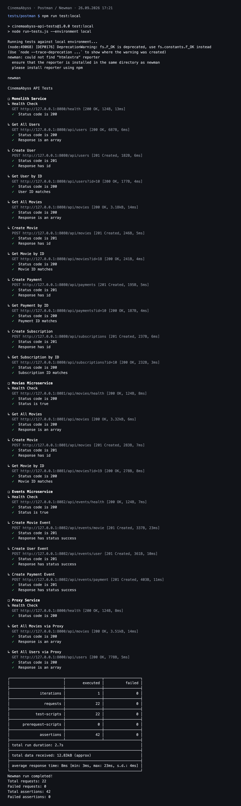
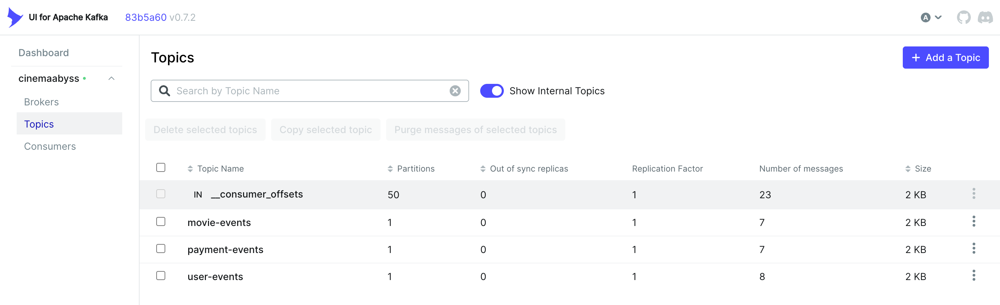
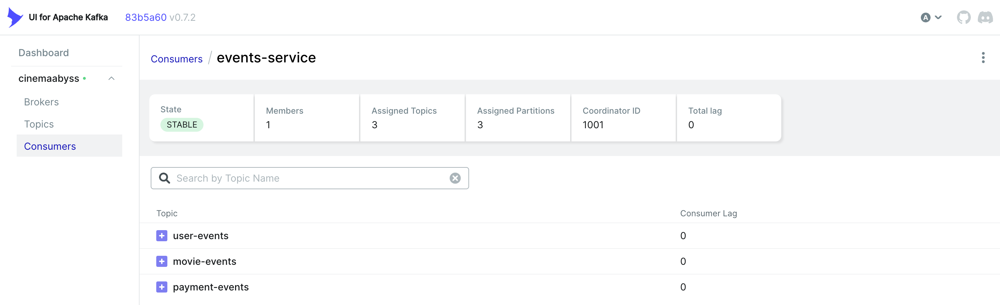
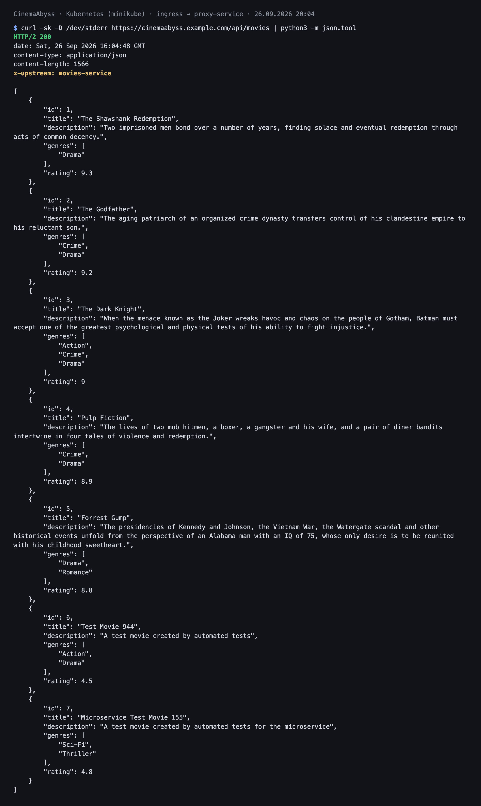
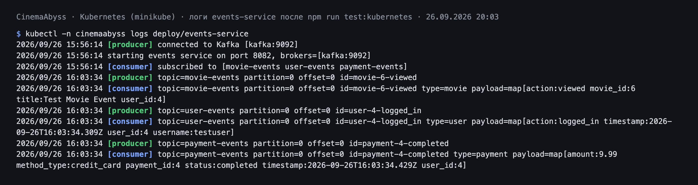
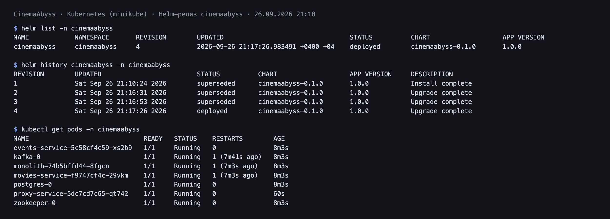
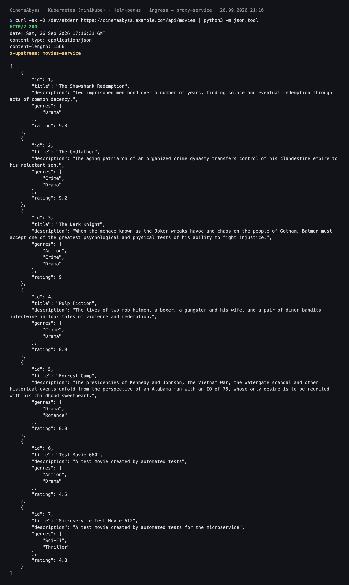
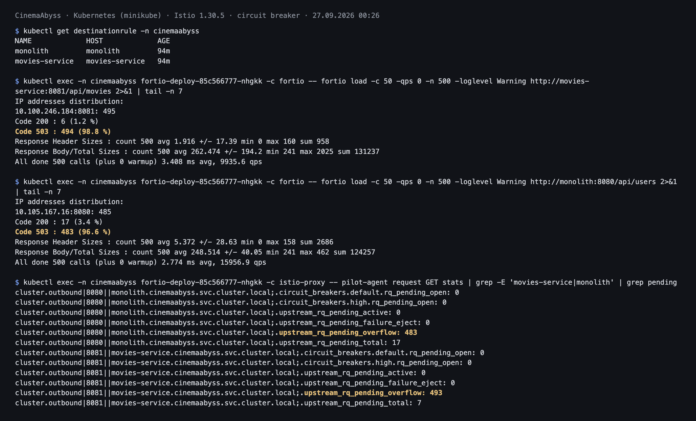

## Изучите [README.md](README.md) файл и структуру проекта.

## Задание 1

1. Спроектируйте to be архитектуру КиноБездны, разделив всю систему на отдельные домены и организовав интеграционное взаимодействие и единую точку вызова сервисов.
Результат представьте в виде контейнерной диаграммы в нотации С4.
Добавьте ссылку на файл в этот шаблон
**Диаграмма контейнеров (To-Be):** [schemas/c4/01-containers-to-be.png](schemas/c4/01-containers-to-be.png)
Исходник PlantUML: [schemas/c4/01-containers-to-be.puml](schemas/c4/01-containers-to-be.puml)



**Домены.** Система разделена по бизнес-событиям: в каждом домене слова «пользователь», «фильм», «подписка» имеют одно значение.

| Домен | За что отвечает | События |
|---|---|---|
| Аккаунты | кто пользователь: регистрация, вход, профиль | аккаунт создан |
| Фильмы (каталог) | карточки фильмов, жанры, актёры; уже выделен | — (в основном чтение) |
| Активность | что пользователь сделал с фильмом | фильм просмотрен, оценён, добавлен в избранное |
| Подписки | тарифы, оформление, автопродление | подписка активирована / истекла, дата списания обновлена |
| Платежи | проведение платежей через внешнего провайдера | платёж проведён / отклонён |
| Лояльность | скидки, промокоды, партнёрские программы | скидка применена |
| Доступ | может ли пользователь смотреть фильм сейчас | доступ открыт / закрыт |
| Рекомендации | ACL к внешней рекомендательной системе | подборка сохранена |

У каждого сервиса своя база данных; связи между доменами — по идентификаторам, без общих таблиц.

**Единая точка входа.** Все клиенты ходят через API Gateway: маршрутизация, проверка JWT, rate limit. Так как клиенты требуют разного объёма данных, перед Gateway стоят два BFF: один на web и mobile (экраны похожи, объём регулируется параметрами запроса; при расхождении можно разделить) и отдельный на Smart TV (навигация пультом, крупная сетка, слабое железо). Три BFF с нуля для команды из пяти разработчиков — лишняя нагрузка.

**Переход от As-Is к To-Be.** На диаграмме показано целевое состояние, поэтому монолита на ней нет. Переход идёт по Strangler Fig: монолит остаётся за API Gateway, домены выносятся по одному, Gateway переключает трафик на новый сервис через feature flag (`MOVIES_MIGRATION_PERCENT` в задании 2). Каталог фильмов уже вынесен; по мере выноса остальных доменов монолит сокращается и в конце удаляется.

**Интеграция.** Правило для каждой связи: нужен ли ответ прямо сейчас.
- Нужен → синхронный REST: проверка права на просмотр, расчёт скидки при оформлении, инициирование платежа.
- Не нужен → событие в Kafka: «платёж проведён» → подписки, «подписка активирована / истекла» → доступ, «аккаунт создан» → лояльность, активность пользователя → рекомендации. Событие не теряется, если сервис-потребитель временно недоступен.


## Задание 2

### 1. Proxy
Команда КиноБездны уже выделила сервис метаданных о фильмах movies и вам необходимо реализовать бесшовный переход с применением паттерна Strangler Fig в части реализации прокси-сервиса (API Gateway), с помощью которого можно будет постепенно переключать траффик, используя фиче-флаг.


Реализуйте сервис на любом языке программирования в ./src/microservices/proxy.
Конфигурация для запуска сервиса через docker-compose уже добавлена
```yaml
  proxy-service:
    build:
      context: ./src/microservices/proxy
      dockerfile: Dockerfile
    container_name: cinemaabyss-proxy-service
    depends_on:
      - monolith
      - movies-service
      - events-service
    ports:
      - "8000:8000"
    environment:
      PORT: 8000
      MONOLITH_URL: http://monolith:8080
      #монолит
      MOVIES_SERVICE_URL: http://movies-service:8081 #сервис movies
      EVENTS_SERVICE_URL: http://events-service:8082 
      GRADUAL_MIGRATION: "true" # вкл/выкл простого фиче-флага
      MOVIES_MIGRATION_PERCENT: "50" # процент миграции
    networks:
      - cinemaabyss-network
```

- После реализации запустите postman тесты - они все должны быть зеленые.
- Отправьте запросы к API Gateway:
   ```bash
   curl http://localhost:8000/api/movies
   ```
- Протестируйте постепенный переход, изменив переменную окружения MOVIES_MIGRATION_PERCENT в файле docker-compose.yml.

### 2. Kafka
 Вам как архитектуру нужно также проверить гипотезу насколько просто реализовать применение Kafka в данной архитектуре.

Для этого нужно сделать MVP сервис events, который будет при вызове API создавать и сам же читать сообщения в топике Kafka.

    - Разработайте сервис на любом языке программирования с consumer'ами и producer'ами.
    - Реализуйте простой API, при вызове которого будут создаваться события User/Payment/Movie и обрабатываться внутри сервиса с записью в лог
    - Добавьте в docker-compose новый сервис, kafka там уже есть

Необходимые тесты для проверки этого API вызываются при запуске npm run test:local из папки tests/postman 
Приложите скриншот тестов и скриншот состояния топиков Kafka http://localhost:8090 

### Решение

**Proxy-сервис** — `src/microservices/proxy` (Go, только стандартная библиотека, `net/http/httputil.ReverseProxy`).

| Путь | Куда уходит запрос |
|---|---|
| `/health` | отвечает сам прокси |
| `/api/movies/health` | movies-service |
| `/api/movies*` | по feature flag: `GRADUAL_MIGRATION=true` → `MOVIES_MIGRATION_PERCENT` % запросов в movies-service, остальные в монолит; `GRADUAL_MIGRATION=false` → весь домен в movies-service |
| `/api/events*` | events-service |
| всё остальное (`/api/users`, `/api/payments`, `/api/subscriptions`) | монолит |

Каждый ответ помечается заголовком `X-Upstream: monolith | movies-service | events-service`, выбор апстрима пишется в лог — так видно, куда реально ушёл запрос. Недоступный или зависший апстрим превращается в `502 {"error": ...}` вместо зависания (таймауты: 3 с на соединение, 10 с на ожидание ответа). Распределение случайное на каждый запрос: оба апстрима читают одну и ту же базу, поэтому пользователь не увидит разных данных при попадании то в монолит, то в сервис. Проверка распределения — в `main_test.go` (`go test ./...`).

**Events-сервис** — `src/microservices/events` (Go, библиотека `github.com/IBM/sarama`).

- `POST /api/events/{movie|user|payment}` проверяет обязательные поля по `api-specification.yaml`, оборачивает тело в `Event {id, type, timestamp, payload}` и публикует в топик `movie-events` / `user-events` / `payment-events`. Ответ `201 {status: "success", partition, offset, event}`.
- Consumer group `events-service` подписан на все три топика и пишет каждое прочитанное событие в лог (`[consumer] topic=... partition=... offset=... id=...`).
- При старте сервис ждёт Kafka с повторными попытками (в docker-compose брокер поднимается позже сервиса).
- `GET /api/events/health` → `{"status": true}`.

Проверка: `docker-compose up -d --build`, затем `cd tests/postman && npm run test:local`; топики и сообщения — в Kafka UI http://localhost:8090.

**Скриншоты:**

Тесты Postman (`npm run test:local`): 22 запроса, 42 проверки, 0 ошибок.



Топики в Kafka UI http://localhost:8090:



Consumer group `events-service` читает все три топика, lag 0:




## Задание 3

Команда начала переезд в Kubernetes для лучшего масштабирования и повышения надежности. 
Вам, как архитектору осталось самое сложное:
 - реализовать CI/CD для сборки прокси сервиса
 - реализовать необходимые конфигурационные файлы для переключения трафика.


### CI/CD

 В папке .github/worflows доработайте деплой новых сервисов proxy и events в docker-build-push.yml , чтобы api-tests при сборке отрабатывали корректно при отправке коммита в вашу новую ветку.

Нужно доработать 
```yaml
on:
  push:
    branches: [ main ]
    paths:
      - 'src/**'
      - '.github/workflows/docker-build-push.yml'
  release:
    types: [published]
```
и добавить необходимые шаги в блок
```yaml
jobs:
  build-and-push:
    runs-on: ubuntu-latest
    permissions:
      contents: read
      packages: write

    steps:
      - name: Checkout repository
        uses: actions/checkout@v3

      - name: Set up Docker Buildx
        uses: docker/setup-buildx-action@v2

      - name: Log in to the Container registry
        uses: docker/login-action@v2
        with:
          registry: ${{ env.REGISTRY }}
          username: ${{ github.actor }}
          password: ${{ secrets.GITHUB_TOKEN }}

```
Как только сборка отработает и в github registry появятся ваши образы, можно переходить к блоку настройки Kubernetes
Успешным результатом данного шага является "зеленая" сборка и "зеленые" тесты


### Proxy в Kubernetes

#### Шаг 1
Для деплоя в kubernetes необходимо залогиниться в docker registry Github'а.
1. Создайте Personal Access Token (PAT) https://github.com/settings/tokens . Создавайте class с правом read:packages
2. В src/kubernetes/*.yaml (event-service, monolith, movies-service и proxy-service)  отредактируйте путь до ваших образов 
```bash
 spec:
      containers:
      - name: events-service
        image: ghcr.io/ваш логин/имя репозитория/events-service:latest
```
3. Добавьте в секрет src/kubernetes/dockerconfigsecret.yaml в поле
```bash
 .dockerconfigjson: значение в base64 файла ~/.docker/config.json
```

4. Если в ~/.docker/config.json нет значения для аутентификации
```json
{
        "auths": {
                "ghcr.io": {
                       тут пусто
                }
        }
}
```
то выполните 

и добавьте

```json 
 "auth": "имя пользователя:токен в base64"
```

Чтобы получить значение в base64 можно выполнить команду
```bash
 echo -n ваш_логин:ваш_токен | base64
```

После заполнения config.json, также прогоните содержимое через base64

```bash
cat .docker/config.json | base64
```

и полученное значение добавляем в

```bash
 .dockerconfigjson: значение в base64 файла ~/.docker/config.json
```

#### Шаг 2

  Доработайте src/kubernetes/event-service.yaml и src/kubernetes/proxy-service.yaml

  - Необходимо создать Deployment и Service 
  - Доработайте ingress.yaml, чтобы можно было с помощью тестов проверить создание событий
  - Выполните дальшейшие шаги для поднятия кластера:

  1. Создайте namespace:
  ```bash
  kubectl apply -f src/kubernetes/namespace.yaml
  ```
  2. Создайте секреты и переменные
  ```bash
  kubectl apply -f src/kubernetes/configmap.yaml
  kubectl apply -f src/kubernetes/secret.yaml
  kubectl apply -f src/kubernetes/dockerconfigsecret.yaml
  kubectl apply -f src/kubernetes/postgres-init-configmap.yaml
  ```

  3. Разверните базу данных:
  ```bash
  kubectl apply -f src/kubernetes/postgres.yaml
  ```

  На этом этапе если вызвать команду
  ```bash
  kubectl -n cinemaabyss get pod
  ```
  Вы увидите

  NAME         READY   STATUS    
  postgres-0   1/1     Running   

  4. Разверните Kafka:
  ```bash
  kubectl apply -f src/kubernetes/kafka/kafka.yaml
  ```

  Проверьте, теперь должно быть запущено 3 пода, если что-то не так, то посмотрите логи
  ```bash
  kubectl -n cinemaabyss logs имя_пода (например - kafka-0)
  ```

  5. Разверните монолит:
  ```bash
  kubectl apply -f src/kubernetes/monolith.yaml
  ```
  6. Разверните микросервисы:
  ```bash
  kubectl apply -f src/kubernetes/movies-service.yaml
  kubectl apply -f src/kubernetes/events-service.yaml
  ```
  7. Разверните прокси-сервис:
  ```bash
  kubectl apply -f src/kubernetes/proxy-service.yaml
  ```

  После запуска и поднятия подов вывод команды 
  ```bash
  kubectl -n cinemaabyss get pod
  ```

  Будет наподобие такого

  NAME                              READY   STATUS    

  events-service-7587c6dfd5-6whzx   1/1     Running  

  kafka-0                           1/1     Running   

  monolith-8476598495-wmtmw         1/1     Running  

  movies-service-6d5697c584-4qfqs   1/1     Running  

  postgres-0                        1/1     Running  

  proxy-service-577d6c549b-6qfcv    1/1     Running  

  zookeeper-0                       1/1     Running 

  8. Добавим ingress

  - добавьте аддон
  ```bash
  minikube addons enable ingress
  ```
  ```bash
  kubectl apply -f src/kubernetes/ingress.yaml
  ```
  9. Добавьте в /etc/hosts
  127.0.0.1 cinemaabyss.example.com

  10. Вызовите
  ```bash
  minikube tunnel
  ```
  11. Вызовите https://cinemaabyss.example.com/api/movies
  Вы должны увидеть вывод списка фильмов
  Можно поэкспериментировать со значением   MOVIES_MIGRATION_PERCENT в src/kubernetes/configmap.yaml и убедится, что вызовы movies уходят полностью в новый сервис

  12. Запустите тесты из папки tests/postman
  ```bash
   npm run test:kubernetes
  ```
  Часть тестов с health-чек упадет, но создание событий отработает.
  Откройте логи event-service и сделайте скриншот обработки событий

#### Шаг 3
Добавьте сюда скриншота вывода при вызове https://cinemaabyss.example.com/api/movies и  скриншот вывода event-service после вызова тестов.

### Решение

**CI/CD** — `.github/workflows/`:
- `docker-build-push.yml`: добавлены сборка и публикация в GHCR образов `events-service` и `proxy-service` (по образцу monolith и movies), workflow запускается при push в ветку `cinema`.
- `api-tests.yml`: тесты запускаются при push в `cinema`.
- `provenance: false` во всех шагах сборки: образ публикуется одиночным amd64-манифестом, а не индексом с аттестацией. Иначе Docker на arm64 (minikube на Apple Silicon) не может его скачать.

Оба workflow зелёные: [Docker Build and Push](https://github.com/mgurbanzade/architecture-pro-cinemaabyss/actions/runs/36252995487), [API Tests](https://github.com/mgurbanzade/architecture-pro-cinemaabyss/actions/runs/36252995466).

**Kubernetes** — `src/kubernetes/`:

| Файл | Что сделано |
|---|---|
| `events-service.yaml` | Deployment + Service (8082); startupProbe даёт сервису до 2 минут на подключение к Kafka |
| `proxy-service.yaml` | Deployment + Service (8000); адреса апстримов и `MOVIES_MIGRATION_PERCENT` берутся из `cinemaabyss-config` |
| `configmap.yaml` | добавлены `EVENTS_SERVICE_URL` и `KAFKA_BROKERS` |
| `ingress.yaml` | `/` → proxy-service (API Gateway), `/api/events` → events-service |
| `monolith.yaml`, `movies-service.yaml` | образы из `ghcr.io/mgurbanzade/architecture-pro-cinemaabyss` |
| `dockerconfigsecret.yaml` | пакеты в GHCR публичные, поэтому секрет содержит пустой `{"auths":{}}` — токен в публичный репозиторий не попадает |

Прокси читает настройки при старте, поэтому после изменения `MOVIES_MIGRATION_PERCENT` его нужно перезапустить: `kubectl -n cinemaabyss rollout restart deployment/proxy-service`.

**Проверка** (minikube с `--container-runtime=docker`: containerd на arm64 не скачивает amd64-образы, в том числе Kafka и ZooKeeper из шаблона):
- все 7 подов в статусе `Running`;
- `MOVIES_MIGRATION_PERCENT` = 0 / 50 / 100 → из 40 запросов к `/api/movies` в movies-service ушло 0 / 19 / 40;
- `npm run test:kubernetes` — 22 запроса, 42 проверки, 0 ошибок.

**Что проверяют health-check'и через ingress.** В окружении `kubernetes` все адреса ведут на ingress, поэтому:
- «Monolith Service / Health Check» и «Proxy Service / Health Check» (`GET /health`) проверяют сам прокси: `/health` он отвечает сам, монолит в этой проверке не участвует;
- «Movies Microservice / Health Check» (`/api/movies/health`) доходит до movies-service при любом `MOVIES_MIGRATION_PERCENT`;
- «Events Microservice / Health Check» (`/api/events/health`) по правилу ingress идёт прямо в events-service.

`/health` прокси намеренно не зависит от монолита: на него смотрят readiness- и liveness-пробы прокси. Если бы он проксировался в монолит, падение монолита выводило бы из строя весь gateway вместе с movies и events. Проверено при остановленном монолите (`replicas=0`): `/health`, `/api/movies` и `/api/events/health` отвечают 200, под прокси остаётся `1/1 Running`, а недоступность монолита ловят его функциональные тесты — `/api/users` не ответил за 10 секунд: у прокси тогда не было таймаутов. После ревью они добавлены (3 с на соединение, 10 с на ответ), а в mesh из задания 5 такой запрос сразу получает `503 no healthy upstream` от sidecar (проверено: ответ за 0,05 с).

**Скриншоты:**

Вызов https://cinemaabyss.example.com/api/movies (при `MOVIES_MIGRATION_PERCENT=100` отвечает movies-service):



Логи events-service после `npm run test:kubernetes`: каждое событие публикуется в Kafka и читается consumer'ом:




## Задание 4
Для простоты дальнейшего обновления и развертывания вам как архитектуру необходимо так же реализовать helm-чарты для прокси-сервиса и проверить работу 

Для этого:
1. Перейдите в директорию helm и отредактируйте файл values.yaml

```yaml
# Proxy service configuration
proxyService:
  enabled: true
  image:
    repository: ghcr.io/db-exp/cinemaabysstest/proxy-service
    tag: latest
    pullPolicy: Always
  replicas: 1
  resources:
    limits:
      cpu: 300m
      memory: 256Mi
    requests:
      cpu: 100m
      memory: 128Mi
  service:
    port: 80
    targetPort: 8000
    type: ClusterIP
```

- Вместо ghcr.io/db-exp/cinemaabysstest/proxy-service напишите свой путь до образа для всех сервисов
- для imagePullSecret проставьте свое значение (скопируйте из конфигурации kubernetes)
  ```yaml
  imagePullSecrets:
      dockerconfigjson: ewoJImF1dGhzIjogewoJCSJnaGNyLmlvIjogewoJCQkiYXV0aCI6ICJaR0l0Wlhod09tZG9jRjl2UTJocVZIa3dhMWhKVDIxWmFVZHJOV2hRUW10aFVXbFZSbTVaTjJRMFNYUjRZMWM9IgoJCX0KCX0sCgkiY3JlZHNTdG9yZSI6ICJkZXNrdG9wIiwKCSJjdXJyZW50Q29udGV4dCI6ICJkZXNrdG9wLWxpbnV4IiwKCSJwbHVnaW5zIjogewoJCSIteC1jbGktaGludHMiOiB7CgkJCSJlbmFibGVkIjogInRydWUiCgkJfQoJfSwKCSJmZWF0dXJlcyI6IHsKCQkiaG9va3MiOiAidHJ1ZSIKCX0KfQ==
  ```

2. В папке ./templates/services заполните шаблоны для proxy-service.yaml и events-service.yaml (опирайтесь на свою kubernetes конфигурацию - смысл helm'а сделать шаблоны для быстрого обновления и установки)

```yaml
template:
    metadata:
      labels:
        app: proxy-service
    spec:
      containers:
       Тут ваша конфигурация
```

3. Проверьте установку
Сначала удалим установку руками

```bash
kubectl delete all --all -n cinemaabyss
kubectl delete  namespace cinemaabyss
```
Запустите 
```bash
helm install cinemaabyss .\src\kubernetes\helm --namespace cinemaabyss --create-namespace
```
Если в процессе будет ошибка
```code
[2025-04-08 21:43:38,780] ERROR Fatal error during KafkaServer startup. Prepare to shutdown (kafka.server.KafkaServer)
kafka.common.InconsistentClusterIdException: The Cluster ID OkOjGPrdRimp8nkFohYkCw doesn't match stored clusterId Some(sbkcoiSiQV2h_mQpwy05zQ) in meta.properties. The broker is trying to join the wrong cluster. Configured zookeeper.connect may be wrong.
```

Проверьте развертывание:
```bash
kubectl get pods -n cinemaabyss
minikube tunnel
```

Потом вызовите 
https://cinemaabyss.example.com/api/movies
и приложите скриншот развертывания helm и вывода https://cinemaabyss.example.com/api/movies

### Решение

**Что доработано в чарте** — `src/kubernetes/helm/`:

| Файл | Что сделано |
|---|---|
| `templates/services/proxy-service.yaml` | Deployment + Service по манифесту из задания 3, все параметры из values; аннотация `checksum/config` перезапускает прокси при изменении configmap |
| `templates/services/events-service.yaml` | Deployment + Service по манифесту из задания 3, startupProbe на время подключения к Kafka |
| `values.yaml` | образы всех сервисов из `ghcr.io/mgurbanzade/architecture-pro-cinemaabyss`; `imagePullSecrets.dockerconfigjson` — тот же пустой `{"auths":{}}`, что в задании 3 |
| `templates/configmap.yaml` | исправлен `MOVIES_SERVICE_URL`, добавлены `EVENTS_SERVICE_URL` и `KAFKA_BROKERS` |

**Дефекты заготовки**, найденные до установки:
- `imagePullSecrets.dockerconfigjson` в `values.yaml` был обрезанным base64: секрет `kubernetes.io/dockerconfigjson` с невалидным JSON не создаётся, и `helm install` падает.
- `MOVIES_SERVICE_URL: http://movies:…`, а Service называется `movies-service`: чарт устанавливается, поды поднимаются, но прокси не находит movies, и `/api/movies` отдаёт 502.
- Проверено и **не** является дефектом: `className: nginx` вместе с аннотацией `kubernetes.io/ingress.class: nginx`. Server-side dry-run показал, что Kubernetes принимает оба поля, если значения совпадают (при расхождении — `must match ingressClassName when both are specified`), поэтому оставлено как есть.

**Порядок проверки:** `helm lint` → `helm template` → server-side dry-run отрендеренного чарта (все объекты — в режиме создания во временном namespace, ingress — в режиме обновления) → удаление ручной установки (`kubectl delete all --all -n cinemaabyss`, `kubectl delete namespace cinemaabyss`) → `helm install cinemaabyss ./src/kubernetes/helm --namespace cinemaabyss --create-namespace`.

**Результат:**
- все 7 подов `Running`; `npm run test:kubernetes` — 22 запроса, 42 проверки, 0 ошибок; события events-service публикуются и читаются.
- `kafka`, `monolith` и `movies-service` при установке перезапускаются по одному разу: Helm создаёт всё одновременно, Kafka не дожидается ZooKeeper, а у монолита и movies HTTP-порт не открывается, пока `db.Ping()` ждёт Postgres, и liveness-проба перезапускает контейнер. Дальше Kubernetes сам доводит систему до рабочего состояния; при ручной установке по шагам этого нет.
- `helm install` пересоздаёт ingress, после этого `minikube tunnel` пришлось перезапустить (с паролем sudo), иначе порты 80/443 не пробрасывались.

**Переключение трафика через Helm.** `MOVIES_MIGRATION_PERCENT` — параметр `config.moviesMigrationPercent` в `values.yaml`, шаблоны править не нужно:

```bash
helm upgrade cinemaabyss ./src/kubernetes/helm -n cinemaabyss --set config.moviesMigrationPercent=0
helm upgrade cinemaabyss ./src/kubernetes/helm -n cinemaabyss --reset-values
```

Благодаря `checksum/config` прокси перезапускается сам: после первой команды 20 из 20 запросов к `/api/movies` ушли в монолит, после второй — в movies-service. `helm upgrade` без `--set` и `-f` переиспользует значения прошлой ревизии, поэтому для возврата к значениям чарта нужен `--reset-values`.

**Скриншоты:**

Helm-релиз (`helm list`, `helm history`, поды):



Вызов https://cinemaabyss.example.com/api/movies после установки чартом:




# Задание 5
Компания планирует активно развиваться и для повышения надежности, безопасности, реализации сетевых паттернов типа Circuit Breaker и канареечного деплоя вам как архитектору необходимо развернуть istio и настроить circuit breaker для monolith и movies сервисов.

```bash

helm repo add istio https://istio-release.storage.googleapis.com/charts
helm repo update

helm install istio-base istio/base -n istio-system --set defaultRevision=default --create-namespace
helm install istio-ingressgateway istio/gateway -n istio-system
helm install istiod istio/istiod -n istio-system --wait

helm install cinemaabyss .\src\kubernetes\helm --namespace cinemaabyss --create-namespace

kubectl label namespace cinemaabyss istio-injection=enabled --overwrite

kubectl get namespace -L istio-injection

kubectl apply -f .\src\kubernetes\circuit-breaker-config.yaml -n cinemaabyss

```

Тестирование

# fortio
```bash
kubectl apply -f https://raw.githubusercontent.com/istio/istio/release-1.25/samples/httpbin/sample-client/fortio-deploy.yaml -n cinemaabyss
```

# Get the fortio pod name
```bash
FORTIO_POD=$(kubectl get pod -n cinemaabyss | grep fortio | awk '{print $1}')

kubectl exec -n cinemaabyss $FORTIO_POD -c fortio -- fortio load -c 50 -qps 0 -n 500 -loglevel Warning http://movies-service:8081/api/movies
```
Например,

```bash
kubectl exec -n cinemaabyss fortio-deploy-b6757cbbb-7c9qg  -c fortio -- fortio load -c 50 -qps 0 -n 500 -loglevel Warning http://movies-service:8081/api/movies
```

Вывод будет типа такого

```bash
IP addresses distribution:
10.106.113.46:8081: 421
Code 200 : 79 (15.8 %)
Code 500 : 22 (4.4 %)
Code 503 : 399 (79.8 %)
```
Можно еще проверить статистику

```bash
kubectl exec -n cinemaabyss fortio-deploy-b6757cbbb-7c9qg -c istio-proxy -- pilot-agent request GET stats | grep movies-service | grep pending
```

И там смотрим 

```bash
cluster.outbound|8081||movies-service.cinemaabyss.svc.cluster.local;.upstream_rq_pending_total: 311 - столько раз срабатывал circuit breaker
You can see 21 for the upstream_rq_pending_overflow value which means 21 calls so far have been flagged for circuit breaking.
```

Приложите скриншот работы circuit breaker'а

Удаляем все
```bash
istioctl uninstall --purge
kubectl delete namespace istio-system
kubectl delete all --all -n cinemaabyss
kubectl delete namespace cinemaabyss
```

### Решение

**Установка Istio 1.30.5 через Helm** — по шаблону, с двумя поправками для локального стенда:
- порядок `istio-base` → `istiod --wait` → `istio-ingressgateway`: поды gateway получают образ прокси через injection istiod, поэтому gateway ставится после istiod;
- Service `istio-ingressgateway` переведён в `ClusterIP` (`helm upgrade istio-ingressgateway istio/gateway -n istio-system --set service.type=ClusterIP`): с типом LoadBalancer `minikube tunnel` отдавал ему порты 80/443 на `127.0.0.1`, и приложение через nginx-ingress переставало отвечать (`Connection reset by peer`). Для circuit breaker входной шлюз Istio не нужен — нагрузка идёт изнутри кластера.

После `kubectl label namespace cinemaabyss istio-injection=enabled` поды нужно перезапустить (`kubectl rollout restart`), иначе sidecar не появится; теперь все поды `2/2`.

**Дефект манифестов Kafka**, всплывший при перезапуске: PVC ZooKeeper был смонтирован в `/var/lib/zookeeper/data`, а образ `wurstmeister/zookeeper` хранит данные в `/opt/zookeeper-3.4.13/data`. После любого перезапуска ZooKeeper терял ID кластера, а Kafka со старым `meta.properties` на своём PVC падала с `InconsistentClusterIdException` — той самой ошибкой, о которой предупреждает задание 4. Исправлен `mountPath` в `src/kubernetes/kafka/kafka.yaml` и `src/kubernetes/helm/templates/kafka/kafka.yaml`, данные Kafka один раз очищены. Проверено: после перезапуска ZooKeeper и Kafka ID кластера сохраняется, рестартов нет.

**Circuit breaker** — `src/kubernetes/circuit-breaker-config.yaml`, `DestinationRule` для `movies-service` и `monolith`:
- `connectionPool`: 1 соединение, 1 запрос в очереди, 1 запрос на соединение — всё сверх этого sidecar клиента сразу отклоняет с 503;
- `outlierDetection`: под исключается из балансировки на 30 секунд после 5 ошибок доступности подряд (502/503/504 и сбои соединения). Бизнес-ошибки 500 под не исключают: монолит и movies отвечают 500 даже на запрос несуществующего id, и с правилом «после первой 5xx» один такой запрос выключал бы `/api/movies` через gateway.

**Проверка** — fortio (`-c 50 -qps 0 -n 500`) из пода с sidecar:

| Цель | Без circuit breaker | С circuit breaker |
|---|---|---|
| `movies-service:8081/api/movies` | 200: 498, ошибки соединения: 2; в среднем 1,27 с на запрос | 200: 6, **503: 494**; в среднем 3,4 мс на запрос |
| `monolith:8080/api/users` | 200: 500 | 200: 17, **503: 483** |

`upstream_rq_pending_overflow` в sidecar fortio — 493 и 483: почти все ответы 503 (493 из 494 у movies и все 483 у монолита) отдал сам circuit breaker при переполнении очереди, не дожидаясь перегруженного сервиса. `upstream_rq_pending_failure_eject` = 0 — выбросов не было. Бизнес-ошибка сервис не выключает: после `GET /api/movies?id=999999` (ответ 500) следующие запросы к `/api/movies` через gateway отвечают 200. При обычной нагрузке система работает: `npm run test:kubernetes` через ingress с Istio и circuit breaker — 22 запроса, 42 проверки, 0 ошибок.

Istio ставился через Helm, поэтому и удалять его удобнее через Helm: `helm uninstall istio-ingressgateway istiod istio-base -n istio-system` (в шаблоне — `istioctl uninstall --purge`).

**Скриншот:**


